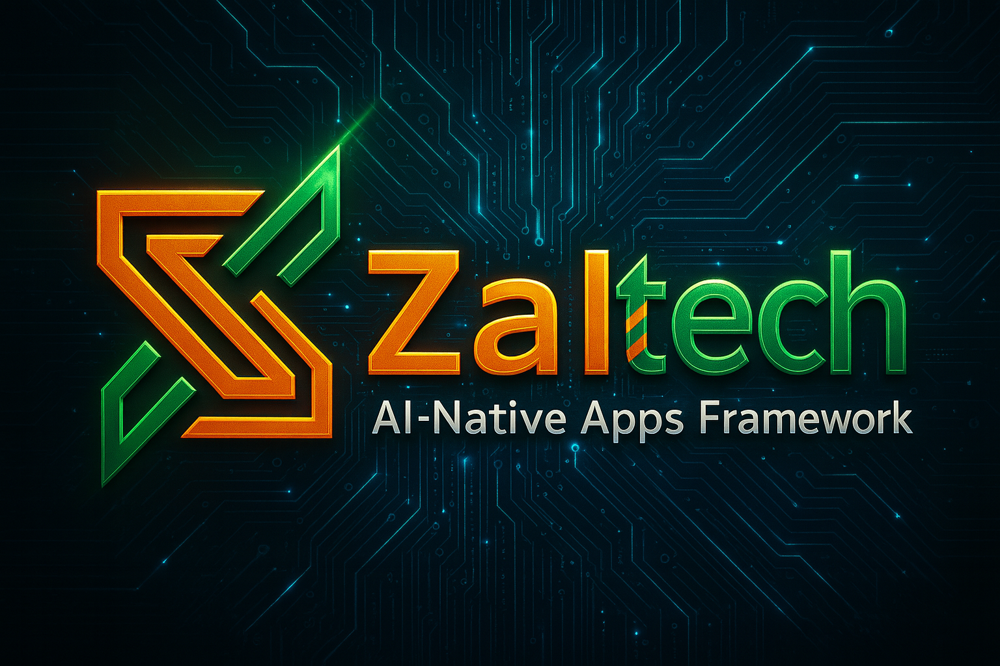
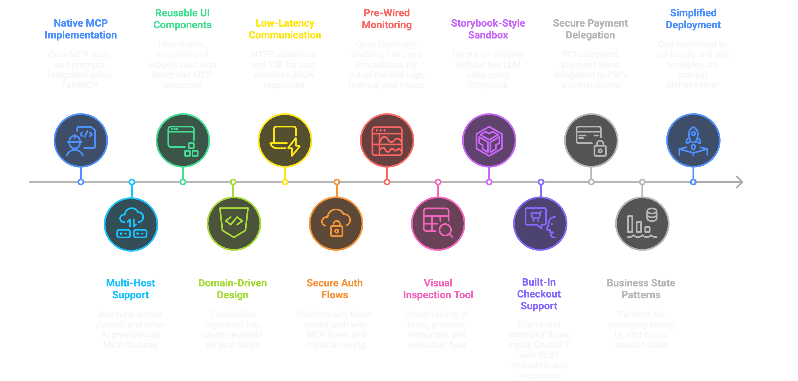
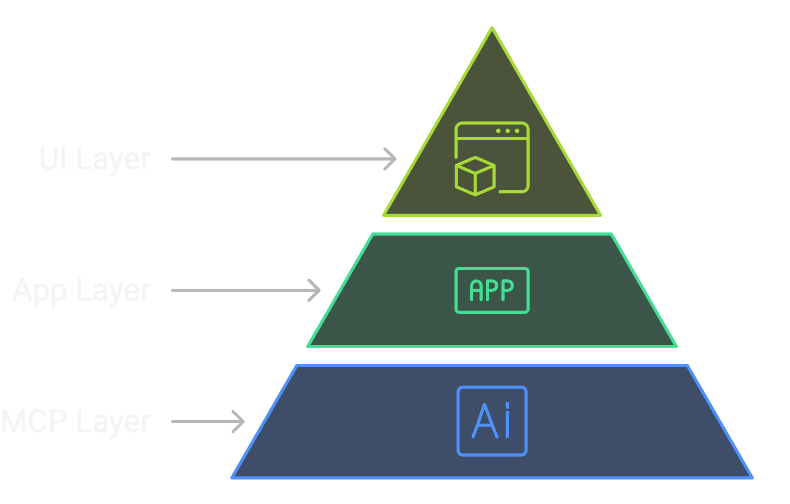
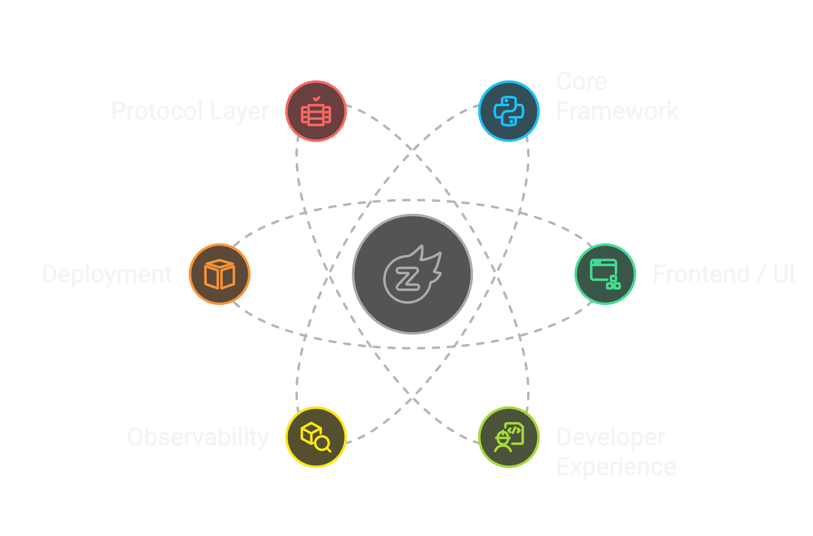

<div align="center">

## Web Apps had React → AI Apps will have Zaltech ❤️‍🔥

</div>

<br/>

<div align="center">
  
</div>

# ⚡ Zaltech

A full-stack framework for building **AI-native, cross-provider applications** that run across **ChatGPT, OpenAI, Gemini, Claude, and any MCP-compatible platforms**. Designed to standardize how you build tools, UI widgets, and integrations on top of the **[Model Context Protocol (MCP)](https://modelcontextprotocol.io/)**.


## Project Status

Zaltech is in active development.

This repository documents the architecture and early design of an AI-native framework
extracted from real products built on top of the Model Context Protocol (MCP).

The framework is not yet public while core abstractions and cross-host runtime
guarantees are still being finalized.

> It will be released publicly once the foundation is stable and reusable, which is currently expected in 2026.


## Why Zaltech Exists

Today, building real AI applications means dealing with:

* Fragmented provider SDKs
* Custom MCP servers per project
* One-off UI bridges for every platform
* No standard way to ship interactive AI apps
* Rewriting the same transport, auth, and rendering logic

Zaltech unifies all of that into **one consistent, standards-aligned developer surface**.


## Core Features


<div align="center">
  
</div>

<br/>


| Feature                      | Description |
|-----------------------------|-------------|
| **MCP-First Architecture**  | Native implementation of MCP tools, resources, prompts, and structured output using the official [MCP SDK](https://modelcontextprotocol.github.io/python-sdk/). |
| **Cross-Provider Runtime**  | Run the same app across multiple hosts; **OpenAI is fully supported today**, with Gemini, Claude, and others following as MCP support matures. |
| **Native AI UI System**     | Host-native, responsive UI components and interactive widgets rendered via MCP resources using [React](https://react.dev/), reusable across chat clients, dashboards, and native or hybrid applications. |
| **Feature-Based Architecture** | Each capability is a vertical slice (tool + logic + UI), giving clean, domain-driven boundaries and easy reuse. |
| **Streaming-First Transport** | Built on HTTP streaming and [SSE](https://developer.mozilla.org/en-US/docs/Web/API/Server-sent_events) for low-latency responses, stateless scaling, and JSON output by default. |
| **Authentication Out of the Box** | OAuth-ready, token-based auth with secure MCP auth flows and minimal configuration. |
| **Observability Built In**  | Batteries-included observability stack with structured logs, request tracing, and dashboards pre-wired via [OpenTelemetry](https://opentelemetry.io/), [Grafana](https://grafana.com/), [Loki](https://grafana.com/oss/loki/), and [Prometheus](https://prometheus.io/) so logs, metrics, and traces work out of the box. |
| **MCP Inspector (First-Class)** | Visual inspection and testing of tools, prompts, resources, logs, and execution flow using [MCP Inspector](https://modelcontextprotocol.io/inspector). |
| **Local Visual UI Testing** | [Storybook](https://storybook.js.org/)-style sandbox for building and iterating on widgets without live LLM calls. |
| **Agentic Checkout** | Built-in support for [Agentic Checkout](https://platform.openai.com/docs/guides/apps-sdk/commerce/agentic-checkout-spec) with REST endpoints, webhooks, and delegated payments for end-to-end checkout flows inside ChatGPT. |
| **Delegated Payment** | Built-in support for [Delegated Payment](https://platform.openai.com/docs/guides/apps-sdk/commerce/delegated-payment-spec) enabling secure payment token delegation to PSPs and merchants with single-use, constrained tokens for PCI-compliant transactions. |
| **State Management** | Built-in patterns for managing [business state on server](https://platform.openai.com/docs/guides/apps-sdk/core-concepts/managing-state), ephemeral UI state in widgets via `window.openai.widgetState`, and cross-session state in your backend storage. |
| **One-Command DX & Deploy** | One command to run locally and one to deploy—no manual infrastructure orchestration. |


## Current Capabilities 

> As of December 2025

Zaltech is designed from day one to support multiple AI providers via MCP, but we want to be fully transparent about what works **today**:

- **Full production support**: Only **ChatGPT/OpenAI** currently offers a mature MCP-based runtime for rich interactive UI widgets.
- **MCP tools & backend logic**: Fully functional and tested on OpenAI, ready for any MCP-compatible host.
- **Rich interactive UI widgets**: Available exclusively on OpenAI/ChatGPT today (using React + OpenAI Apps UI SDK).
- **Payments (Agentic Checkout / Delegated Payment)**: OpenAI-only for now.
- **All other features** (auth, streaming, observability, state management, local testing): Production-ready on OpenAI.

Support for Gemini, Claude, Grok, and others will activate as soon as they ship equivalent UI runtimes. We’re not waiting — the abstractions are built — but rich UI depends on the hosts catching up.


## Architecture

Zaltech is **feature-first across the entire stack**, with each feature implemented as a complete vertical slice spanning three layers.

<div align="center">
  
</div>

### Three-Layer Feature Architecture

Each feature is organized as a self-contained vertical slice:

```
feature_name/
├── mcp/src/features/{feature}/      # MCP Layer
│   ├── tool.py                      # MCP tool definition & handler
│   ├── resource.py                  # Widget resource definitions
│   └── models.py                    # Pydantic data models
│
├── app/src/features/{feature}/      # App Layer
│   ├── generator.py                 # Core business logic
│   └── extractor.py                 # Trigger/keyword extraction
│
└── ui/src/features/{feature}/       # UI Layer
    └── React component              # Embedded widget for AI hosts
```

### Layer Responsibilities

**MCP Layer** (`mcp/src/features/`)
- Defines MCP tools, schemas, and UI resources
- Handles tool registration and routing
- Manages authentication and authorization per tool
- Exposes widget resources via MCP resource endpoints

**App Layer** (`app/src/features/`)
- Implements business logic and domain rules
- Handles provider routing and AI API calls
- Processes data extraction and transformation
- Manages state and orchestration

**UI Layer** (`ui/src/features/`)
- React components rendered as embedded widgets
- Interactive UI for AI host platforms
- State management via widget state APIs
- Responsive layouts using Apps SDK UI primitives


## Tech Stack

Zaltech is an opinionated full-stack framework with a **Python backend** and **TypeScript frontend**, providing a modern, type-safe developer experience and leveraging industry-standard tools to deliver a production-ready foundation.


#### Core Framework
- **[FastAPI](https://fastapi.tiangolo.com/)** – High-performance Python web framework  
- **[Pydantic](https://docs.pydantic.dev/)** – Data validation & settings management  

#### Frontend & UI
- **[React](https://react.dev/)** + **[TypeScript](https://www.typescriptlang.org/)** – Modern, type-safe UI layer  
- **[Tailwind CSS](https://tailwindcss.com/)** – Utility-first styling  
- **[Vite](https://vitejs.dev/)** – Blazing-fast build tool & dev server  
- **[OpenAI Apps UI SDK](https://openai.github.io/apps-sdk-ui/)** – Official ChatGPT-native components (For OpenAI Apps) 

#### Developer Experience
- **[Storybook](https://storybook.js.org/)** – Isolated UI sandbox (no LLM calls required)  
- **[Vitest](https://vitest.dev/)** – Fast unit & integration testing for React components  
- **[Pytest](https://pytest.org/)** – Python testing framework with fixtures & plugins  
- **[MCP Inspector](https://modelcontextprotocol.io/inspector)** – Visual debugging for tools, prompts, resources & logs  
- 
#### Observability
- **[OpenTelemetry](https://opentelemetry.io/)** – Traces, metrics & logs instrumentation  
- **[Prometheus](https://prometheus.io/)** + **[Grafana](https://grafana.com/)** – Metrics & dashboards  
- **[Loki](https://grafana.com/oss/loki/) + Promtail** – Log aggregation & querying  

#### Infrastructure & Deployment
- **[Docker](https://www.docker.com/)** – Containerized services  
- **[Docker Compose](https://docs.docker.com/compose/)** – One-command local & production-ready stack  

#### Protocol Layer
- **[MCP Python SDK](https://github.com/modelcontextprotocol/python-sdk)** – Official Model Context Protocol implementation  

<div align="center">
  
</div>


## For ChatGPT App Developers

If you're building **ChatGPT Native Apps today**, you typically start by wiring together the **[OpenAI Apps SDK](https://github.com/modelcontextprotocol/python-sdk)** and **[OpenAI Apps UI SDK](https://openai.github.io/apps-sdk-ui/)**, then you still have to figure out **project structure, streaming, state, auth, payments, deployment, tooling, and much more**.

Zaltech is an easy **starter framework** built **directly on top of both SDKs and more**, delivered **pre-wired with structure, observability, visual UI sandbox, and much more**, so you can ship immediately instead of assembling infrastructure.


## AI Providers Support

| Rank | AI Provider              | MCP Tool Support      | Interactive UI Support | Zaltech Current Support          | Expected Future                              |
|------|--------------------------|-----------------------|-----------------------------|---------------------------------|----------------------------------------------|
| 1    | **ChatGPT (OpenAI)**    | ✅ Ready              | ✅ Ready                     | Full (tools + UI)   | Already shipping production apps             |
| 2    | **Google Gemini**       | ✅ Ready              | ⏳ Pending                   | Tools only                      | UI runtime anticipated in 2026 updates        |
| 3    | **Anthropic Claude**    | ✅ Ready              | ⏳ Pending                   | Tools only                      | UI enhancements likely as MCP evolves         |
| 4    | **Mistral AI**          | ✅ Ready              | ⏳ Pending                   | Tools only                      | Rich UI pending provider adoption            |
| 5    | **Grok (xAI)**           | ✅ Ready              | ⏳ Pending                   | Tools only                      | UI surface expected with platform growth     |
| 6    | **Perplexity AI**       | ✅ Ready              | ⏳ Pending                   | Tools only                      | Future agentic UI support probable           |
| 7    | **Meta LLaMA**           | 🟡 Partial            | ⏳ Pending                   | Community/Indirect tools        | Depends on third-party hosts/runners          |
| 8    | **Other Hosts**         | 🟡 Varies             | 🟡 Host-dependent            | Tools where MCP is implemented  | UI support varies by host implementation     |


## How It Came to Be

Zaltech started as internal infrastructure for building multiple AI-native products
using the OpenAI Apps SDK and MCP from the earliest preview releases, with the
expectation from day zero that the foundation would need to support more than
one product.

Because there was no established app framework, the first product was built in an
intentionally extractable way, anticipating the same problems would need to be
solved again: tool structure, streaming, state management, UI rendering, auth,
deployment, and observability.

As additional products were built on top of the same core, those shared patterns
were validated, refined, and progressively hardened into a single reusable
foundation. That foundation became Zaltech.


## Vision

> Make building AI-native applications as standard as building web apps.

## Community

[Join us on Discord](https://discord.com/invite/e2arxq9Js4) to stay updated.

## License

Distributed under the MIT License. See [`LICENSE`](./LICENSE) for more information.

## Credits

Created by **[Mahmoud Zalt](https://zalt.me/)**, supported by **[Sista AI](https://sista.ai)**.

<div align="center">
  <a href="https://sista.ai/">
    
  </a>
</div>
